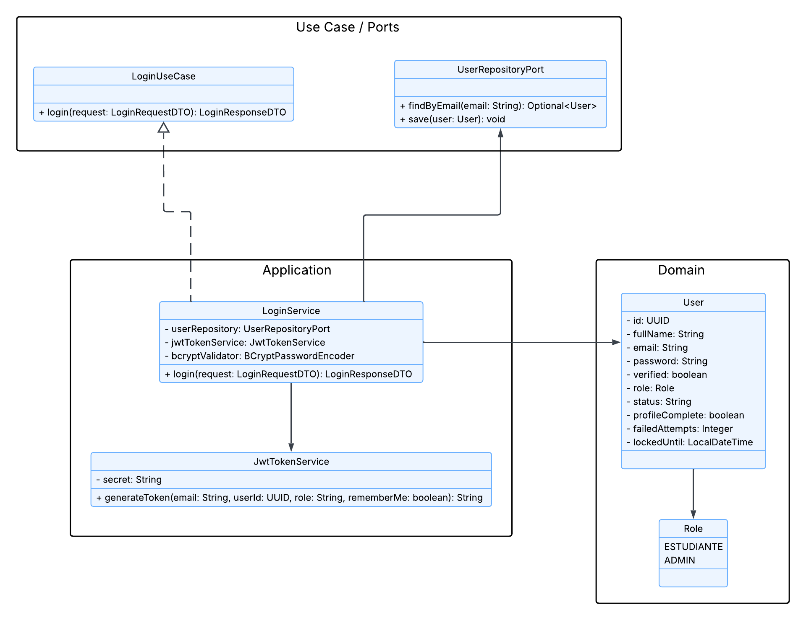
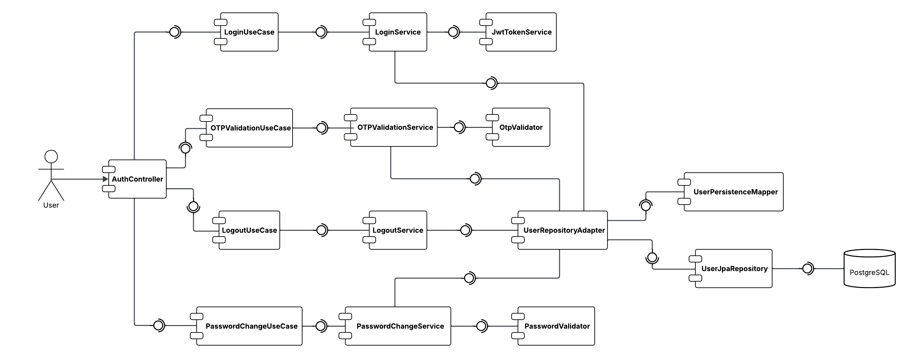
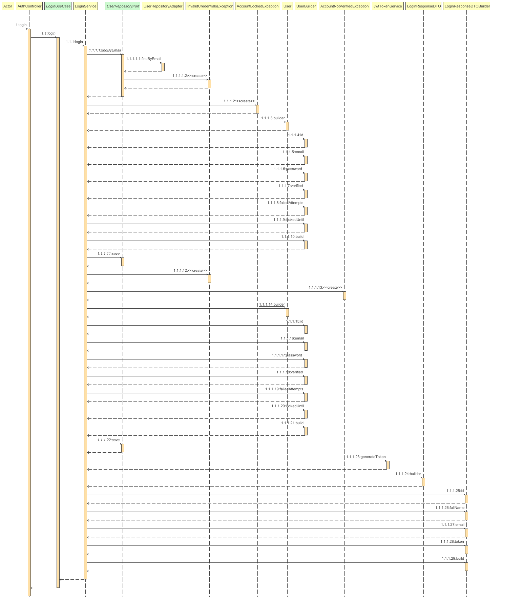

<div align="center">

# 🔐 AIBERT — Authentication Service

### *"Acceso seguro y centralizado para toda la plataforma AIBERT"*

---

### 🛠️ Stack Tecnológico


### ☁️ Infraestructura & Calidad


### 🏗️ Arquitectura


</div>

---

## 📑 Tabla de Contenidos

1. [👤 Integrantes](#1--integrantes)
2. [🎯 Objetivo del Microservicio](#2--objetivo-del-microservicio)
3. [⚡ Funcionalidades Principales](#3--funcionalidades-principales)
4. [📋 Estrategia de Versionamiento y Branches](#4--manejo-de-estrategia-de-versionamiento-y-branches)
5. [⚙️ Tecnologías Utilizadas](#5--tecnologias-utilizadas)
6. [🧩 Funcionalidad](#6--funcionalidad)
7. [📊 Diagramas](#7--diagramas)
8. [⚠️ Manejo de Errores](#8--manejo-de-errores)
9. [🧪 Evidencia de Pruebas y Ejecución](#9--evidencia-de-las-pruebas-y-como-ejecutarlas)
10. [🗂️ Organización del Código](#10--codigo-de-la-implementacion-organizado-en-las-respectivas-carpetas)
11. [🚀 Ejecución del Proyecto](#11--ejecucion-del-proyecto)
12. [☁️ CI/CD y Despliegue en Azure](#12--evidencia-de-cicd-y-despliegue-en-azure)
13. [🤝 Contribuciones](#13--contribuciones)

---

## 1. 👤 Integrantes

- **Equipo:** Grootyology

---

## 2. 🎯 Objetivo del microservicio

Básicamente este servicio es el portero de AIBERT. Cuando alguien quiere entrar al sistema, pasa por acá primero — valida que seas quien dices ser, te da un token JWT y listo, ya puedes moverte por la plataforma.

La idea es que ningún otro microservicio tenga que preocuparse por autenticación. Eso es problema de este servicio, y solo de este.

---

## 3. ⚡ Funcionalidades principales

<div align="center">

<table>
  <thead>
    <tr>
      <th>🧩 Funcionalidad</th>
      <th>¿Qué hace?</th>
    </tr>
  </thead>
  <tbody>
    <tr>
      <td><strong>Inicio de Sesión</strong></td>
      <td>Revisa tus credenciales y te deja pasar si todo está bien.</td>
    </tr>
    <tr>
      <td><strong>Generación de JWT</strong></td>
      <td>Te da un token firmado que los demás servicios usan para saber quién eres.</td>
    </tr>
    <tr>
      <td><strong>Blacklist de Tokens</strong></td>
      <td>Si cerrás sesión, el token queda inválido aunque no haya expirado.</td>
    </tr>
    <tr>
      <td><strong>Protección de Cuentas</strong></td>
      <td>Si fallás el login varias veces, la cuenta se bloquea un rato. También maneja cuentas inactivas o no verificadas.</td>
    </tr>
    <tr>
      <td><strong>Seguridad Centralizada</strong></td>
      <td>Un solo lugar para manejar auth. Los demás servicios no necesitan saber nada de esto.</td>
    </tr>
  </tbody>
</table>

</div>

---

## 4. 📋 Manejo de Estrategia de versionamiento y branches

Usamos **Git Flow** para no pisarnos entre nosotros y tener siempre una versión estable lista.

### Ramas que manejamos

- `main` — lo que está en producción, no se toca directamente.
- `develop` — acá se integra todo antes de subir a main.
- `feature/*` — una rama por cada cosa que estemos haciendo.

Algunas ramas que usamos:
- `feature/auth-ci-cd`
- `feature/dockerizacion`
- `feature/nuevos-requerimientos`

### Cómo trabajamos

1. Crear rama `feature/*` desde `develop`.
2. Implementar y probar local.
3. Abrir PR hacia `develop`.
4. Cuando `develop` está estable, se mergea a `main`.

---

## 5. ⚙️ Tecnologías Utilizadas

| Tecnología | Para qué la usamos |
|------------|-------------------|
| **Java 21** | Lenguaje base. |
| **Spring Boot 3.4.3** | El framework que levanta todo. |
| **Spring Security** | Filtros de seguridad y configuración HTTP. |
| **Spring Data JPA** | Para hablar con la base de datos sin tanto boilerplate. |
| **PostgreSQL** | Donde guardamos los usuarios. |
| **jjwt** | Para generar y validar los tokens JWT. |
| **MapStruct** | Mapeo entre dominio y persistencia sin escribir código a mano. |
| **Apache Maven** | Build y dependencias. |
| **Docker** | Para correr el servicio en cualquier lado. |
| **GitHub Actions** | El pipeline de CI/CD. |
| **SonarCloud** | Análisis de calidad del código. |
| **JaCoCo** | Ver qué tan bien cubrimos con los tests. |

---

## 6. 🧩 Funcionalidad

### 🔐 Login

Mandás email y password, el servicio verifica que todo esté bien y te devuelve un JWT.

**Endpoint:** `POST /api/auth/login`

### 📦 Request

<div align="center">

| 🏷️ Campo | 🗃️ Tipo | ⚠️ Restricción | 📝 Descripción |
|---------|---------|:-------------:|---------------|
| email | String | Obligatorio | Tu correo |
| password | String | Obligatorio | Tu contraseña |

</div>

### 📦 Response

<div align="center">

| 🏷️ Campo | 🗃️ Tipo | 📝 Descripción |
|---------|---------|---------------|
| token | String | El JWT firmado para usar en los demás servicios |
| expiresAt | LocalDateTime | Cuándo vence el token |

</div>

---

### 🔒 Protección de cuentas

El servicio detecta automáticamente estos casos y bloquea el acceso:

- **No verificada** → el usuario no confirmó su email todavía.
- **Inactiva** → la cuenta está desactivada.
- **Bloqueada** → demasiados intentos fallidos, se bloquea temporalmente.

---

## 7. 📊 Diagramas

### 🧱 Diagrama de Clases

Muestra cómo está organizado el código por capas: Entrypoints, Application, Domain e Infrastructure, y cómo el `AuthController` delega al `LoginUseCase`.

<div align="center">



</div>

---

### 🧩 Diagrama de Componentes

Cómo interactúan los componentes durante el login, con la separación de responsabilidades por puertos y adaptadores.

<div align="center">



</div>

---

### 🔁 Diagrama de Secuencia — `POST /api/auth/login`

El flujo completo del login paso a paso: desde que llegan las credenciales hasta que sale el JWT.

<div align="center">



</div>

---

## 8. ⚠️ Manejo de Errores

Hay un `@ControllerAdvice` que atrapa todos los errores y devuelve respuestas limpias y consistentes, sin exponer nada interno.

<div align="center">

| 🔢 Código HTTP | ⚠️ Cuándo pasa |
|:-------------:|:------------|
| **400 Bad Request** | Faltan campos o el formato está mal. |
| **401 Unauthorized** | Email o contraseña incorrectos. |
| **403 Forbidden** | Cuenta bloqueada, inactiva o no verificada. Token inválido o expirado. |
| **500 Internal Server Error** | Algo explotó en el servidor. |

</div>

---

## 9. 🧪 Evidencia de Pruebas y Ejecución

Tenemos pruebas unitarias para todo lo importante:

- `LoginService` — los flujos de autenticación y los casos de error.
- `JwtTokenService` — generación y validación de tokens.
- `TokenBlacklistService` — invalidación de tokens.
- `AuthController` — los endpoints.
- `GlobalExceptionHandler` — que los errores se manejen bien.
- `UserRepositoryAdapter` — el adaptador de persistencia.

### 🚀 Cómo correr las pruebas

```bash
mvn clean test
```

Para ver el reporte de cobertura con JaCoCo:

```bash
mvn clean verify
# El reporte queda en: target/site/jacoco/index.html
```

---

## 10. 🗂️ Organización del Código (Scaffolding)

```
auth-service/
│
├── 📁 src/
│   ├── 📁 main/
│   │   ├── 📁 java/com/aibert/dosw/
│   │   │   ├── 📁 application/                     # 🔵 CAPA DE APLICACIÓN
│   │   │   │   ├── 📁 dto/
│   │   │   │   │   ├── 📁 request/                 # LoginRequestDTO
│   │   │   │   │   └── 📁 response/                # LoginResponseDTO
│   │   │   │   └── 📁 service/                     # LoginService, JwtTokenService, TokenBlacklistService
│   │   │   │
│   │   │   ├── 📁 config/                          # ⚙️ SecurityConfig, SwaggerConfig
│   │   │   │
│   │   │   ├── 📁 domain/                          # 🟢 CAPA DE DOMINIO
│   │   │   │   ├── 📁 exceptions/                  # InvalidCredentials, AccountLocked, AccountInactive, AccountNotVerified
│   │   │   │   ├── 📁 model/user/                  # User, Role, UserStatus
│   │   │   │   └── 📁 ports/in/                    # LoginUseCase
│   │   │   │
│   │   │   ├── 📁 entrypoints/                     # 🔴 CAPA DE ENTRADA
│   │   │   │   ├── 📁 rest/controller/             # AuthController
│   │   │   │   └── 📁 advice/                      # GlobalExceptionHandler
│   │   │   │
│   │   │   ├── 📁 infrastructure/adapters/         # 🟠 CAPA DE INFRAESTRUCTURA
│   │   │   │   ├── 📁 adapter/                     # UserRepositoryAdapter
│   │   │   │   └── 📁 persistence/
│   │   │   │       ├── 📁 entity/                  # UserEntity
│   │   │   │       ├── 📁 mapper/                  # UserPersistenceMapper (MapStruct)
│   │   │   │       └── 📁 repository/              # UserJpaRepository
│   │   │   │
│   │   │   └── AuthServiceApplication
│   │   │
│   │   └── 📁 resources/                           # application.yml (perfiles: local, qa, prod)
│   │
│   └── 📁 test/                                    # 🧪 Pruebas unitarias
│
└── pom.xml
```

---

## 11. 🚀 Ejecución del Proyecto

### 📋 Qué necesitás antes de arrancar
- **Java 21**
- **Maven 3.8+**
- **PostgreSQL** corriendo (o tirá Docker)
- Las variables de entorno del `.env.example`

### Variables de entorno

```env
DB_URL=jdbc:postgresql://localhost:5432/auth_db
DB_USER=postgres
DB_PASSWORD=tu_password
JWT_SECRET=tu_secreto_jwt
```

### 🛠️ Opción 1: Maven directo

```bash
mvn spring-boot:run -Dspring-boot.run.profiles=local
```

📍 **Local:** `http://localhost:8080`
📚 **Swagger:** `http://localhost:8080/swagger-ui.html`

### 🐳 Opción 2: Docker Compose

```bash
docker-compose up --build -d
```

---

## 12. ☁️ CI/CD y Despliegue en Azure

El pipeline se activa solo con cada push o PR a `develop` o `main`. Los pasos son:

1. **Compilation** — compila el proyecto.
2. **Tests** — corre los tests con H2 en memoria y publica resultados.
3. **Analysis** — genera el reporte JaCoCo y lo manda a SonarCloud.
4. **Build & Push Image** — construye la imagen Docker y la sube a `ghcr.io`.
5. **Deploy to QA** — despliega en Azure Container Apps cuando hay push a `develop`.
6. **Deploy to PROD** — despliega en producción cuando hay push a `main`.

### Secrets que necesitás configurar en GitHub

| Secret | Para qué |
|--------|----------|
| `SONAR_TOKEN` | Análisis con SonarCloud |
| `AZURE_CREDENCIALES_QA` | Deploy en QA |
| `AZURE_CREDENCIALES_PROD` | Deploy en producción |
| `GHCR_TOKEN` | Subir imagen a GitHub Container Registry |

---

## 13. 🤝 Contribuciones

Trabajamos con **Scrum** en iteraciones cortas. `main` y `develop` están protegidas — todo entra por PR y tiene que pasar el pipeline completo (compilación, tests y SonarCloud) antes de mergearse.

<div align="center">

### 🏆 Proyecto AIBERT


</div>
